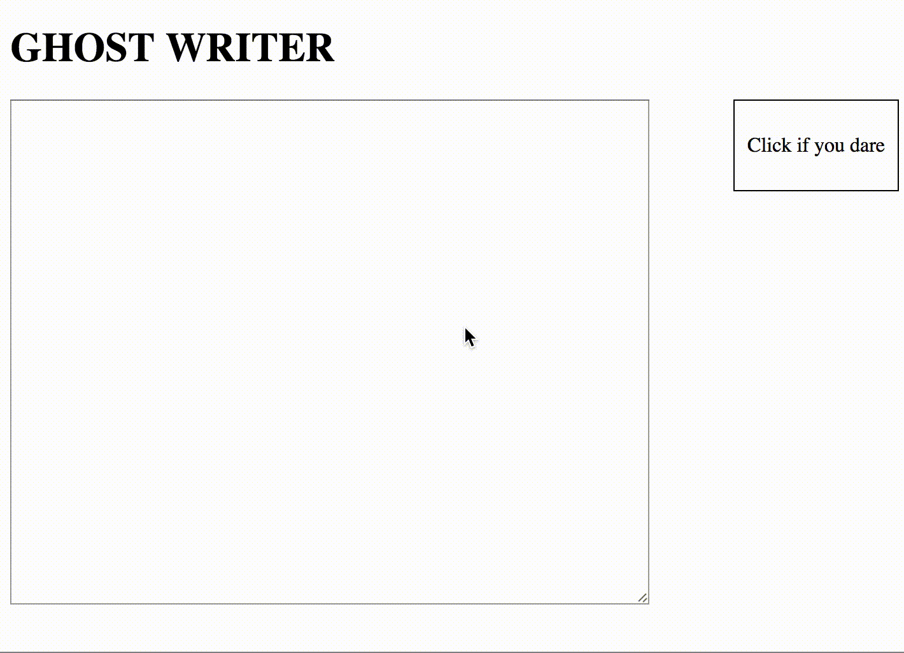

# THE GHOST WRITER!
##### In this lesson you will be using jQuery to create a spooky ghost writer web page.

## Let's start with the HTML
* Use the tags: `<h1>` and `<textarea>` to create a page that looks something like this.

*If you are stuck trying to make the textarea bigger, here's a [hint](https://www.w3schools.com/tags/tryit.asp?filename=tryhtml_textarea)*
* Add a `
` to the page that has a `
` inside it saying "click if you dare"

## Some CSS
* Put a border around the "click if you dare" `div` 
* Add some padding to the "click if you dare" `div`
* Use the `float` CSS property to push the "click if you dare" `div` to the right

## The sPoOkY jQuery
#### Just a quick check
* Go to your `script.js` file
* `console.log` something inside the `$(document).ready(function(){` to make sure it's working
#### Okay, let's use `keypress()`
* Before we dive into a new jQuery function, write some code that hides the "click if you dare" `div` once the page is loaded.
* Now, we want to know when someone types in the `<textarea>`. May I suggest, jQuery's `keypress()` event. Remember to google if you need to!
* Once you've set up the `keypress()` function use `console.log("a key was pressed!")` to make sure it's working.
* Now that we know when a key is typed, we want to know which key is being typed...
* Write an if/else statement to figure out whether the user typed the letter 'a' or not. 
  * If the key typed is an 'a', use `console.log()` to print out "An 'a' was typed!". 
  * If any other letter is typed, print out "A key other than 'a' was typed."

### Okay spoookify
* When someone types an 'a', instead of console logging, set the background color to darkgreen. Use jQuery selectors, and the `css()` function to do this. 
* Now let's use an `else if` so when someone types an 'f' the color of the heading turns white. 
* Else if someone types a 'p': show the 'Click if you dare' div that we hid earlier. 
* Else if someone types an 'n': `fadeOut()` the `<body>` slowly, and then fade it back in slowly. Hint: this will take two lines of code. 
* Else if someone types a 'e': append 'hello, is anyone there?' to the body of the HTML. Enclose what you append in `
` tags. 
* Else if someone types a 'i': move the textarea 80px to the right. You can do this with the css() function. 
* Else if someone types an 's': change the text of the `<h1>` tag to say "I'M TRAPPED". The jQuery text() function might come in handy here. 
* Else if someone types an 'l': set the background image of the `<body>` to the url of the scaryclown.jpg image inside the images folder. 
* Else if someone types a 'w': APPEND 'Would you like to play a game' inside a `
` tag. 
* Else if someone types a 'g': PREPEND 'HELP ME!!!' inside an `<h3>` tag.
* Else if someone types a 'q': clear out all the text in the textarea. Hint: you can use the val() function to set the value of the textarea to an empty string. 
* Else if someone types an 'o': remove the scary clown background image of the `<body>`. [Hint](https://stackoverflow.com/questions/6747176/how-can-i-remove-a-background-image-attribute).
* And now, type the story in the `textarea` and watch the ghost writer emerge: 
"It was friday night and I was going to the movies when I saw a scary clown. I said a scary clown!!! c-l-o-w-n. AH!!" in the `textarea`

### If you dare...
* Use the `click()` function to capture a click on the 'Click if you dare' div.
* Console.log 'clicked!' inside your click function to make sure it's working.
* Now it's time to really scare some people. When someone clicks on the 'Click if you dare' div, make your webpage do this: 

### Extension
* Right now these effects don't work if the letters are capitalized. Can you make this work too?

